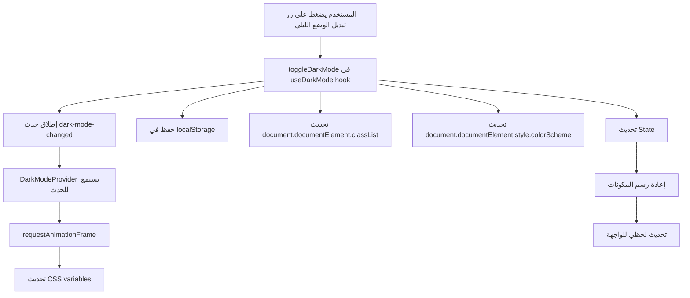

# إصلاح الوضع الليلي - التحديث اللحظي ودعم جميع البلوكات

## المشاكل التي تم حلها

### 1. ❌ مشكلة عدم التحديث اللحظي
- **المشكلة**: كان المستخدم يحتاج لعمل Refresh للصفحة لرؤية تغيير الوضع الليلي
- **السبب**: عدم وجود آلية لفرض إعادة رسم المكونات
- **الحل**: إضافة نظام أحداث مخصص وتحسين `useDarkMode` hook

### 2. ❌ البلوك الأول لا يدعم الوضع الليلي
- **المشكلة**: البلوك الأول (Welcome Section) كان له خلفية زرقاء ثابتة
- **السبب**: استخدام ألوان ثابتة بدلاً من كلاسات ديناميكية
- **الحل**: تحديث البلوك لاستخدام كلاسات شرطية حسب الوضع

## التعديلات التقنية

### 1. تحسين `useDarkMode` Hook
```typescript
// hooks/useDarkMode.ts
- إضافة useCallback للدوال
- إضافة mounted state للتحكم في hydration
- إضافة colorScheme للمتصفح
- إضافة حدث مخصص 'dark-mode-changed'
- تحسين الأداء باستخدام useCallback
```

### 2. تحديث `DarkModeProvider`
```typescript
// components/DarkModeProvider.tsx
- إزالة التطبيق المزدوج للكلاسات
- إضافة listener للحدث المخصص
- استخدام requestAnimationFrame للأداء السلس
- تحديث CSS variables ديناميكياً
```

### 3. تحديث البلوك الأول (Welcome Section)
```typescript
// app/page.tsx - Welcome Section
- تغيير الخلفية من ثابتة إلى ديناميكية:
  * الوضع النهاري: gradient أزرق
  * الوضع الليلي: gradient رمادي غامق
- تحديث جميع العناصر الداخلية لدعم الوضعين
- إضافة transitions سلسة
```

## التحسينات المضافة

### 1. الأداء
- استخدام `requestAnimationFrame` لتحديثات سلسة
- منع re-renders غير ضرورية
- تحسين hydration في SSR

### 2. تجربة المستخدم
- تحديث لحظي بدون flashing
- انتقالات سلسة (300ms - 500ms)
- دعم تفضيلات النظام
- حفظ الاختيار في localStorage

### 3. التوافقية
- دعم جميع المتصفحات الحديثة
- دعم prefers-color-scheme
- توافق مع Next.js 15 و Tailwind CSS

## آلية العمل



## النتيجة النهائية

✅ **الوضع الليلي يعمل لحظياً** - بدون الحاجة لتحديث الصفحة
✅ **جميع البلوكات تدعم الوضع الليلي** - بما فيها البلوك الأول
✅ **انتقالات سلسة** - تجربة مستخدم محسنة
✅ **أداء محسن** - بدون تأثير على سرعة الموقع

## ملاحظات للمطورين

1. عند إضافة بلوكات جديدة، استخدم كلاسات Tailwind الديناميكية:
   ```jsx
   className={`${darkMode ? 'dark-classes' : 'light-classes'}`}
   ```

2. استخدم `useDarkMode` hook في أي مكون يحتاج لمعرفة الوضع الحالي:
   ```jsx
   const { darkMode, toggleDarkMode } = useDarkMode();
   ```

3. للألوان المخصصة، استخدم CSS variables:
   ```css
   :root {
     --primary-color: #0f52ba;
   }
   .dark {
     --primary-color: #3b82f6;
   }
   ```

## الاختبار

1. افتح الموقع في المتصفح
2. اضغط على زر الشمس/القمر في الهيدر
3. يجب أن تتغير جميع العناصر لحظياً
4. تحقق من البلوك الأول - يجب أن يتغير من أزرق إلى رمادي غامق
5. أعد تحميل الصفحة - يجب أن يبقى الاختيار محفوظاً 