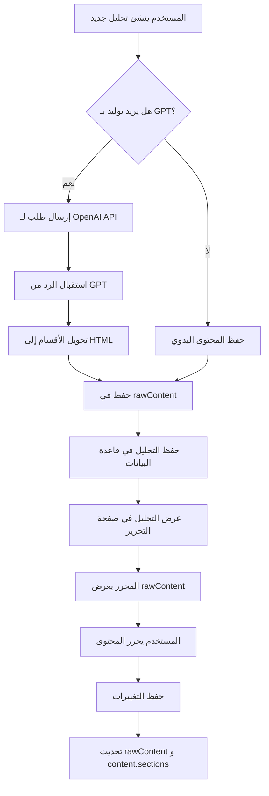

# حل مشكلة حفظ المحتوى المولد من GPT في نظام التحليل العميق

## المشكلة الأساسية
عند توليد تحليل عميق باستخدام GPT، كان المحتوى يُولد بنجاح لكن لا يُحفظ بشكل صحيح في قاعدة البيانات، مما يؤدي إلى ظهور التحليل فارغًا عند فتحه للتحرير أو العرض.

## السبب الجذري
1. **تنسيق البيانات**: GPT يرجع المحتوى في شكل أقسام (sections) منظمة، بينما المحرر يتوقع HTML خام
2. **حقل مفقود**: لم يكن هناك حقل `rawContent` لحفظ المحتوى بتنسيق HTML للعرض في المحرر
3. **عدم التحويل**: لم يتم تحويل الأقسام المولدة إلى HTML عند الحفظ

## الحل المطبق

### 1. تحديث هيكل البيانات
في `types/deep-analysis.ts`:
```typescript
export interface DeepAnalysis {
  // ... حقول أخرى
  content: AnalysisContent;      // المحتوى المنظم في أقسام
  rawContent?: string;           // المحتوى الخام بتنسيق HTML للمحرر
  // ...
}
```

### 2. تحديث API لحفظ المحتوى بشكل صحيح
في `app/api/deep-analyses/route.ts`:
```typescript
// دالة تحويل الأقسام إلى HTML
function convertSectionsToHTML(sections: any[]): string {
  if (!sections || sections.length === 0) return '';
  
  return sections.map(section => {
    return `<h2>${section.title}</h2>\n${section.content}`;
  }).join('\n\n');
}

// في دالة POST
if (body.generateWithGPT) {
  // توليد التحليل
  const gptResponse = await generateDeepAnalysis({...});
  
  analysisContent = gptResponse.analysis.content;
  // تحويل المحتوى إلى HTML للعرض في المحرر
  rawContent = convertSectionsToHTML(analysisContent.sections);
} else {
  // إذا لم يكن توليد GPT، استخدم المحتوى المرسل
  rawContent = body.content || '';
}
```

### 3. تحديث API لحفظ التعديلات
في `app/api/deep-analyses/[id]/route.ts`:
```typescript
// في دالة PUT
...(body.content && { 
  rawContent: body.content,
  content: {
    ...currentAnalysis.content,
    sections: [{
      id: 'section-1',
      title: 'المحتوى الرئيسي',
      content: body.content,
      order: 1,
      type: 'text'
    }]
  }
}),
```

### 4. تحديث واجهة التحرير لعرض المحتوى الصحيح
في `app/dashboard/deep-analysis/[id]/edit/page.tsx`:
```typescript
const fetchAnalysis = async () => {
  const data: DeepAnalysis = await response.json();
  
  // استخدام rawContent للعرض في المحرر
  setFormData({
    title: data.title,
    summary: data.summary,
    categories: data.categories,
    content: data.rawContent || data.content.sections.map(s => s.content).join('\n\n')
  });
};
```

### 5. دعم إعادة التوليد في واجهة التحرير
```typescript
const handleRegenerate = async () => {
  const response = await fetch('/api/deep-analyses/generate', {...});
  
  if (response.ok) {
    const data = await response.json();
    
    // تحويل الأقسام إلى HTML
    const htmlContent = data.sections.map((section: any) => 
      `<h2>${section.title}</h2>\n${section.content}`
    ).join('\n\n');
    
    setFormData({
      ...formData,
      content: htmlContent,
      summary: data.summary || formData.summary
    });
  }
};
```

## مسار البيانات الكامل



## نصائح للمستخدمين

### عند إنشاء تحليل جديد:
1. بعد توليد المحتوى بـ GPT، تأكد من الضغط على "حفظ كمسودة" أو "نشر التحليل"
2. المحتوى المولد سيظهر مباشرة في المحرر ويمكن تعديله
3. يمكن إعادة التوليد في أي وقت من صفحة التحرير

### عند تحرير تحليل موجود:
1. المحتوى سيظهر تلقائيًا في المحرر
2. أي تعديلات ستُحفظ في كل من `rawContent` (للعرض) و `content.sections` (للتنظيم)
3. يمكن إعادة توليد المحتوى بالكامل أو تحريره يدويًا

## التحسينات المستقبلية المقترحة

1. **حفظ تلقائي**: إضافة خاصية الحفظ التلقائي بعد التوليد مباشرة
2. **معاينة مباشرة**: إضافة زر معاينة لرؤية كيف سيظهر التحليل للقراء
3. **تحويل ذكي**: تحسين دالة تحويل الأقسام لدعم تنسيقات أكثر تعقيدًا
4. **نسخ احتياطية**: حفظ نسخة من المحتوى الأصلي المولد من GPT قبل أي تعديلات

## الخلاصة
تم حل المشكلة بإضافة حقل `rawContent` لحفظ المحتوى بتنسيق HTML، وتحديث جميع نقاط التكامل لضمان حفظ وعرض المحتوى بشكل صحيح في جميع مراحل دورة حياة التحليل. 