# 📬 صندوق التواصل الذكي - نظام متكامل للرسائل

## 🎯 نظرة عامة
نظام متكامل لإدارة رسائل واستفسارات المستخدمين بشكل احترافي ومنظم، يتيح للزوار التواصل مع إدارة "سبق الذكية" بسهولة وسلاسة.

## ✨ المميزات الرئيسية

### 1. **واجهة المستخدم**
- صفحة تواصل أنيقة وسهلة الاستخدام
- نموذج متكامل مع التحقق الفوري
- دعم رفع الملفات (صور، PDF، فيديوهات)
- رسائل نجاح وخطأ واضحة
- دعم كامل للوضع الليلي
- تصميم متجاوب للجوال

### 2. **أنواع الرسائل**
```typescript
- 💡 اقتراح (suggestion)
- 🚩 بلاغ (complaint)  
- 💬 ملاحظة (feedback)
- ❤️ شكر وتقدير (appreciation)
- 📨 أخرى (other)
```

### 3. **لوحة الإدارة**
- عرض شامل لجميع الرسائل
- فلترة حسب النوع والحالة
- بحث متقدم في الرسائل
- نظام رد مباشر
- إدارة حالات الرسائل
- عرض المرفقات وتحميلها

## 🛠️ البنية التقنية

### 1. **الملفات الأساسية**
```
/app/contact/page.tsx          # صفحة التواصل العامة
/app/dashboard/messages/page.tsx # لوحة إدارة الرسائل
/app/api/messages/route.ts     # API endpoints
/data/messages.json           # قاعدة بيانات الرسائل
```

### 2. **نموذج البيانات**
```typescript
interface Message {
  id: string;
  type: 'suggestion' | 'complaint' | 'feedback' | 'appreciation' | 'other';
  subject: string;
  message: string;
  email: string;
  file_url?: string;
  status: 'new' | 'read' | 'processed' | 'archived';
  created_at: string;
  updated_at?: string;
  response?: string;
  responded_at?: string;
  responded_by?: string;
}
```

### 3. **API Endpoints**
```typescript
GET    /api/messages    # جلب الرسائل مع فلترة وتصفح
POST   /api/messages    # إرسال رسالة جديدة
PUT    /api/messages    # تحديث رسالة (حالة/رد)
DELETE /api/messages    # حذف رسالة
```

## 🔐 الأمان والحماية

### 1. **التحقق من المدخلات**
- تحقق من صحة البريد الإلكتروني
- حد أدنى وأقصى لطول النصوص
- التحقق من أنواع وأحجام الملفات
- حماية من حقن SQL/XSS

### 2. **قيود رفع الملفات**
- **الأنواع المسموحة**: 
  - صور: JPEG, PNG, GIF, WebP
  - مستندات: PDF
  - فيديو: MP4, WebM, OGG
- **الحجم الأقصى**: 10MB

## 📊 سير العمل

```mermaid
graph LR
    A[المستخدم يملأ النموذج] --> B[التحقق من البيانات]
    B --> C{صحيحة؟}
    C -->|نعم| D[رفع الملف إن وجد]
    C -->|لا| E[عرض رسالة خطأ]
    D --> F[حفظ في قاعدة البيانات]
    F --> G[إرسال رسالة نجاح]
    G --> H[الرسالة تظهر في لوحة الإدارة]
    H --> I[المدير يراجع الرسالة]
    I --> J[المدير يرد/يؤرشف/يحذف]
```



## 🎨 واجهة المستخدم

### صفحة التواصل
- **Header جذاب**: أيقونة بريد مع عنوان ووصف
- **نموذج منظم**: حقول واضحة مع تسميات
- **أزرار أنواع الرسائل**: اختيار سريع وبصري
- **منطقة رفع الملفات**: سحب وإفلات أو اختيار
- **معلومات إضافية**: خصوصية وبريد بديل

### لوحة الإدارة
- **قائمة الرسائل**: عرض مختصر مع معلومات أساسية
- **تفاصيل الرسالة**: عرض كامل مع إجراءات
- **نافذة الرد**: محرر نص مع معاينة
- **شريط الحالة**: إحصائيات سريعة

## 🚀 التحسينات المستقبلية

### 1. **الذكاء الاصطناعي**
- تصنيف تلقائي للرسائل
- اقتراح ردود ذكية
- كشف المحتوى الضار
- تحليل المشاعر

### 2. **التكاملات**
- إرسال إشعارات بريد إلكتروني
- ربط مع أنظمة CRM
- تصدير التقارير
- WebHooks للتكامل الخارجي

### 3. **التحليلات**
- إحصائيات أنواع الرسائل
- معدلات الاستجابة
- رضا المستخدمين
- تقارير دورية

## 📝 أمثلة الاستخدام

### إرسال رسالة عبر API
```javascript
fetch('/api/messages', {
  method: 'POST',
  headers: {
    'Content-Type': 'application/json'
  },
  body: JSON.stringify({
    type: 'suggestion',
    subject: 'اقتراح تحسين الموقع',
    message: 'أقترح إضافة خاصية البحث الصوتي...',
    email: 'user@example.com'
  })
});
```

### جلب الرسائل مع فلترة
```javascript
// جلب الرسائل الجديدة فقط
fetch('/api/messages?status=new&page=1&limit=20');

// جلب البلاغات فقط
fetch('/api/messages?type=complaint');
```

## 🌟 مزايا تجربة المستخدم

1. **سهولة الوصول**: رابط واضح في القائمة الرئيسية
2. **تصميم بديهي**: واجهة بسيطة وواضحة
3. **تغذية راجعة فورية**: رسائل نجاح وخطأ واضحة
4. **دعم متعدد اللغات**: جاهز للتوسع
5. **أداء سريع**: تحميل وإرسال سلس

## 🔧 الصيانة والدعم

### مسارات الملفات
- **الرسائل**: `/data/messages.json`
- **المرفقات**: `/public/uploads/` (يتطلب تنفيذ)
- **السجلات**: يمكن ربطها بنظام السجلات الموجود

### نصائح الأداء
- تنظيف الرسائل القديمة دورياً
- ضغط الملفات المرفوعة
- استخدام CDN للملفات الكبيرة
- فهرسة قاعدة البيانات للبحث السريع

---

تم إنشاء هذا النظام ليكون قابلاً للتوسع والتطوير، مع الحفاظ على البساطة والأداء العالي. 