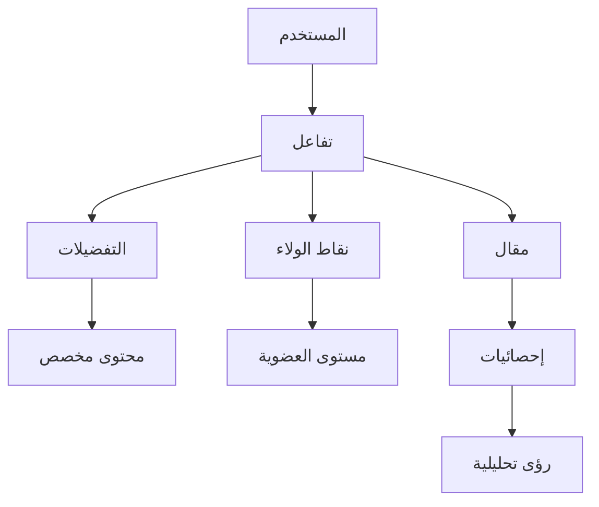

# 🧠 النظام الذكي المتكامل - ملخص تنفيذي

## ✅ ما تم إنجازه

### 1. **نظام التفاعلات المتكامل** 🔥
- ✅ تسجيل جميع أنواع التفاعلات (مشاهدة، قراءة، إعجاب، مشاركة، حفظ، تعليق)
- ✅ ربط التفاعلات بنقاط الولاء تلقائياً
- ✅ تحديث تفضيلات المستخدم بناءً على السلوك
- ✅ تحديث إحصائيات المقالات في الوقت الفعلي

### 2. **نظام التخصيص الذكي** 🎯
- ✅ خوارزمية ذكية لتحليل تفضيلات المستخدم
- ✅ توصيات مخصصة بناءً على:
  - التصنيفات المفضلة
  - المؤلفين المفضلين
  - أوقات القراءة المفضلة
  - معدل إكمال القراءة
- ✅ مكون `PersonalizedFeed` جاهز للاستخدام

### 3. **نظام المكافآت السلوكية** 🎁
- ✅ مكافآت تلقائية على:
  - النشاط المنتظم (100 نقطة شهرياً)
  - معدل إكمال عالي (50 نقطة)
  - التنوع في التفاعل (30 نقطة)
- ✅ تحليل شامل لسلوك المستخدم
- ✅ لوحة تحكم متقدمة للتحليلات

### 4. **الأدوات المساعدة** 🛠️
- ✅ `useInteractions` Hook للتفاعلات
- ✅ APIs متكاملة وموثقة
- ✅ دليل تكامل شامل مع أمثلة

## 📊 خريطة البيانات



## 🔗 سلسلة التفاعل الذكية

1. **المستخدم يقرأ مقال** → 
2. **تسجيل التفاعل** → 
3. **منح نقاط الولاء** → 
4. **تحديث التفضيلات** → 
5. **تحسين التوصيات** → 
6. **عرض محتوى أفضل** 🔄

## 📈 الفوائد المحققة

### للمستخدمين:
- 🎯 محتوى مخصص يناسب اهتماماتهم
- 🏆 مكافآت على النشاط والتفاعل
- 📊 تجربة قراءة محسنة
- ⏰ توصيات في الأوقات المناسبة

### للإدارة:
- 📊 فهم عميق لسلوك المستخدمين
- 🎯 استهداف دقيق للمحتوى
- 📈 زيادة معدلات التفاعل
- 🔍 رؤى تحليلية قيمة

## 🚀 كيفية الاستخدام

### 1. في صفحة المقال:
```tsx
import { useInteractions } from '@/hooks/useInteractions';

// تسجيل قراءة
recordInteraction({
  userId: 'user-123',
  articleId: 'article-456',
  interactionType: 'read',
  duration: 180,
  completed: true
});
```

### 2. في الصفحة الرئيسية:
```tsx
import PersonalizedFeed from '@/components/PersonalizedFeed';

<PersonalizedFeed userId={userId} limit={10} />
```

### 3. في لوحة التحكم:
- `/dashboard/analytics/behavior` - تحليل السلوك
- `/dashboard/loyalty` - إدارة الولاء
- `/dashboard/users` - إدارة المستخدمين

## 🔧 المتطلبات التقنية

### APIs المطلوبة:
- ✅ `/api/interactions` - تسجيل وتحليل التفاعلات
- ✅ `/api/content/personalized` - المحتوى المخصص
- ✅ `/api/loyalty/*` - نظام الولاء

### ملفات البيانات:
- ✅ `user_article_interactions.json`
- ✅ `user_preferences.json`
- ✅ `user_loyalty_points.json`
- ✅ `loyalty_updates_log.json`

## 📋 قائمة المهام للفريق

### عاجل:
- [ ] دمج `PersonalizedFeed` في الصفحة الرئيسية
- [ ] إضافة تتبع القراءة في صفحات المقالات
- [ ] تفعيل حساب المكافآت اليومي

### متوسط الأولوية:
- [ ] إنشاء لوحة معلومات للمستخدم
- [ ] إضافة إشعارات للمكافآت
- [ ] تحسين خوارزمية التوصيات

### طويل المدى:
- [ ] نقل البيانات لقاعدة بيانات حقيقية
- [ ] إضافة Machine Learning للتوصيات
- [ ] تطوير نظام A/B Testing

## 🎉 النتيجة النهائية

**نظام ذكي متكامل** يربط بين:
- 🔗 المستخدمين والمحتوى
- 🎯 السلوك والمكافآت
- 🧠 التفضيلات والتخصيص
- 📊 البيانات والرؤى

كل تفاعل يحسن التجربة، وكل نقطة تزيد الولاء! 🚀 