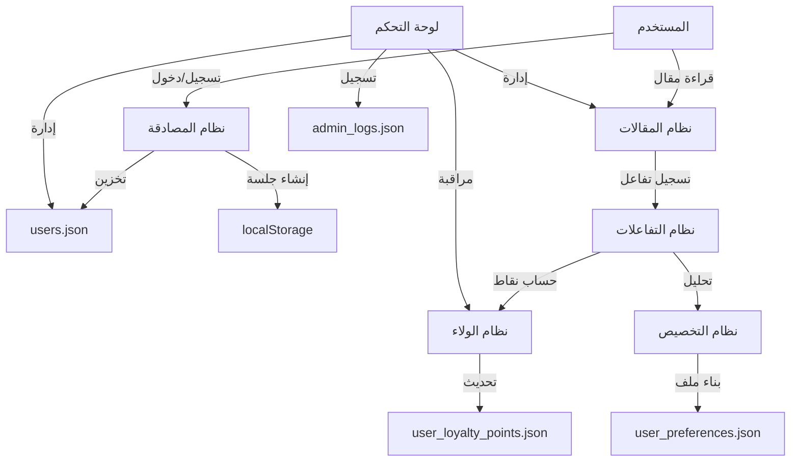

# 📚 التوثيق الشامل لصحيفة سبق الذكية

## 📅 آخر تحديث: 19 يونيو 2025

---

## 📋 جدول المحتويات

1. [نظرة عامة](#نظرة-عامة)
2. [هيكل قواعد البيانات](#هيكل-قواعد-البيانات)
3. [المتغيرات الأساسية](#المتغيرات-الأساسية)
4. [واجهات برمجة التطبيقات (APIs)](#واجهات-برمجة-التطبيقات)
5. [خريطة الربط بين الأنظمة](#خريطة-الربط-بين-الأنظمة)
6. [نظام التخزين المؤقت](#نظام-التخزين-المؤقت)
7. [الأنظمة الفرعية](#الأنظمة-الفرعية)

---

## 🌐 نظرة عامة

صحيفة سبق الذكية هي منصة إخبارية متطورة تستخدم:
- **Next.js 15.3.3** مع Turbopack
- **TypeScript** للأمان النوعي
- **Tailwind CSS** للتصميم
- **نظام ملفات JSON** لتخزين البيانات (مؤقتاً)
- **localStorage** للبيانات المحلية

### 🏗️ هيكل المشروع
```
sabq-ai-cms-new/
├── app/                    # صفحات التطبيق (App Router)
│   ├── dashboard/         # لوحة التحكم
│   ├── api/              # واجهات برمجة التطبيقات
│   └── (public)/         # الصفحات العامة
├── components/           # المكونات المشتركة
├── data/                # ملفات البيانات (JSON)
├── lib/                 # المكتبات والأدوات
├── public/              # الملفات الثابتة
└── types/              # تعريفات TypeScript
```

---

## 💾 هيكل قواعد البيانات

### ⚠️ ملاحظة مهمة
المشروع حالياً يستخدم **ملفات JSON** للتخزين. في بيئة الإنتاج، يُنصح بالترحيل إلى قاعدة بيانات حقيقية.

### 📁 ملفات البيانات الرئيسية

#### 1. `users.json`
```json
{
  "users": [
    {
      "id": "string (unique)",              // معرف فريد
      "name": "string",                      // الاسم الكامل
      "email": "string (unique)",            // البريد الإلكتروني
      "password": "string (hashed)",         // كلمة المرور المشفرة
      "avatar": "string (url) | null",       // رابط الصورة الشخصية
      "role": "admin|editor|media|vip|trainee|regular", // الدور
      "status": "active|suspended|banned|deleted",      // الحالة
      "isVerified": "boolean",               // التحقق من البريد
      "email_verified": "boolean",           // تأكيد البريد
      "loyaltyPoints": "number",             // نقاط الولاء
      "created_at": "ISO 8601 string",       // تاريخ الإنشاء
      "updated_at": "ISO 8601 string",       // آخر تحديث
      "lastLogin": "ISO 8601 string | null", // آخر دخول
      "phone": "string | null",              // رقم الهاتف
      "gender": "male|female|unspecified",   // الجنس
      "country": "string | null",            // الدولة
      "city": "string | null",               // المدينة
      "interests": "string[]"                // الاهتمامات
    }
  ]
}
```

#### 2. `articles.json`
```json
{
  "articles": [
    {
      "id": "string (unique)",               // معرف المقال
      "title": "string",                     // العنوان
      "slug": "string (unique)",             // الرابط الثابت
      "excerpt": "string",                   // المقتطف
      "content": "string (HTML/Markdown)",   // المحتوى
      "featuredImage": "string (url)",       // الصورة البارزة
      "category": "object",                  // التصنيف
      "author": {                            // الكاتب
        "id": "string",
        "name": "string",
        "avatar": "string | null"
      },
      "tags": "string[]",                    // الوسوم
      "publishedAt": "ISO 8601 string",      // تاريخ النشر
      "updatedAt": "ISO 8601 string",        // آخر تحديث
      "status": "published|draft|scheduled", // الحالة
      "scheduledFor": "ISO 8601 string | null", // موعد النشر
      "views": "number",                     // عدد المشاهدات
      "likes": "number",                     // عدد الإعجابات
      "shares": "number",                    // عدد المشاركات
      "readTime": "number",                  // وقت القراءة (دقائق)
      "isAIGenerated": "boolean",            // مولد بالذكاء الاصطناعي
      "aiPrompt": "string | null",           // موجه الذكاء الاصطناعي
      "metadata": "object"                   // بيانات إضافية
    }
  ]
}
```

#### 3. `categories.json`
```json
{
  "categories": [
    {
      "id": "number",                        // معرف التصنيف
      "name": "string",                      // الاسم
      "slug": "string (unique)",             // الرابط الثابت
      "description": "string",               // الوصف
      "icon": "string (emoji/icon)",         // الأيقونة
      "color": "string (hex)",               // اللون
      "parent_id": "number | null",          // التصنيف الأب
      "order": "number",                     // الترتيب
      "article_count": "number",             // عدد المقالات
      "is_active": "boolean",                // نشط/غير نشط
      "created_at": "ISO 8601 string",       // تاريخ الإنشاء
      "updated_at": "ISO 8601 string"        // آخر تحديث
    }
  ]
}
```

#### 4. `user_loyalty_points.json`
```json
{
  "users": [
    {
      "user_id": "string",                   // معرف المستخدم
      "total_points": "number",              // إجمالي النقاط
      "earned_points": "number",             // النقاط المكتسبة
      "redeemed_points": "number",           // النقاط المستبدلة
      "created_at": "ISO 8601 string",       // تاريخ الإنشاء
      "last_updated": "ISO 8601 string"      // آخر تحديث
    }
  ],
  "updated_at": "ISO 8601 string"            // آخر تحديث للملف
}
```

#### 5. `user_article_interactions.json`
```json
{
  "interactions": [
    {
      "id": "string",                        // معرف التفاعل
      "user_id": "string",                   // معرف المستخدم
      "article_id": "string",                // معرف المقال
      "interaction_type": "read|like|share|save|view", // نوع التفاعل
      "timestamp": "ISO 8601 string",        // وقت التفاعل
      "points_earned": "number",             // النقاط المكتسبة
      "duration": "number | null",           // مدة القراءة (ثواني)
      "metadata": "object"                   // بيانات إضافية
    }
  ]
}
```

#### 6. `user_preferences.json`
```json
{
  "preferences": [
    {
      "user_id": "string",                   // معرف المستخدم
      "categories": "number[]",              // التصنيفات المفضلة
      "topics": "string[]",                  // المواضيع المفضلة
      "authors": "string[]",                 // الكتاب المفضلون
      "notification_settings": {             // إعدادات الإشعارات
        "email": "boolean",
        "push": "boolean",
        "sms": "boolean"
      },
      "reading_preferences": {               // تفضيلات القراءة
        "font_size": "small|medium|large",
        "theme": "light|dark|auto",
        "language": "ar|en"
      },
      "created_at": "ISO 8601 string",
      "updated_at": "ISO 8601 string"
    }
  ]
}
```

#### 7. `admin_logs.json`
```json
{
  "logs": [
    {
      "id": "string",                        // معرف السجل
      "admin_id": "string",                  // معرف المسؤول
      "admin_name": "string",                // اسم المسؤول
      "action": "string",                    // الإجراء
      "target_type": "user|article|category", // نوع الهدف
      "target_id": "string",                 // معرف الهدف
      "details": "object",                   // تفاصيل الإجراء
      "ip_address": "string",                // عنوان IP
      "user_agent": "string",                // معلومات المتصفح
      "timestamp": "ISO 8601 string"         // وقت الإجراء
    }
  ]
}
```

#### 8. `messages.json`
```json
{
  "messages": [
    {
      "id": "string",                        // معرف الرسالة
      "from": {                              // المرسل
        "id": "string",
        "name": "string",
        "role": "string"
      },
      "to": {                                // المستقبل
        "id": "string",
        "name": "string",
        "role": "string"
      },
      "subject": "string",                   // الموضوع
      "message": "string",                   // الرسالة
      "status": "unread|read|archived",      // الحالة
      "timestamp": "ISO 8601 string",        // وقت الإرسال
      "attachments": "array"                 // المرفقات
    }
  ]
}
```

#### 9. `templates.json`
```json
{
  "templates": [
    {
      "id": "number",                        // معرف القالب
      "name": "string",                      // الاسم
      "type": "header|footer|sidebar",       // النوع
      "content": "object",                   // المحتوى
      "is_active": "boolean",                // نشط/غير نشط
      "is_default": "boolean",               // افتراضي
      "logo_url": "string | null",           // رابط الشعار
      "primary_color": "string",             // اللون الأساسي
      "secondary_color": "string",           // اللون الثانوي
      "created_at": "ISO 8601 string",
      "updated_at": "ISO 8601 string"
    }
  ]
}
```

---

## 🔑 المتغيرات الأساسية

### معرفات النظام (System IDs)

| المتغير | النوع | الوصف | التنسيق | مثال |
|---------|-------|-------|---------|------|
| `userId` | string | معرف المستخدم الفريد | `user-{timestamp}-{random}` | `user-1750236579398-3h4rt6gu7` |
| `articleId` | string | معرف المقال الفريد | `article-{timestamp}-{random}` | `article-1750236579398-abc123` |
| `categoryId` | number | معرف التصنيف | رقم تسلسلي | `1`, `2`, `3` |
| `interactionId` | string | معرف التفاعل | `{userId}-{articleId}-{type}-{timestamp}` | `user123-article456-read-1750236579398` |
| `messageId` | string | معرف الرسالة | `msg-{timestamp}-{random}` | `msg-1750236579398-xyz789` |
| `templateId` | number | معرف القالب | رقم تسلسلي | `1`, `2`, `3` |

### متغيرات الجلسة (Session Variables)

| المتغير | المكان | الوصف | نوع البيانات |
|---------|--------|-------|--------------|
| `user` | localStorage | بيانات المستخدم الحالي | JSON Object |
| `user_id` | localStorage | معرف المستخدم فقط | string |
| `currentUser` | localStorage | نسخة احتياطية من بيانات المستخدم | JSON Object |
| `user_loyalty_points` | localStorage | نقاط الولاء المحلية | number |
| `darkMode` | localStorage | حالة الوضع الليلي | boolean |
| `preferences` | localStorage | تفضيلات المستخدم | JSON Object |

### متغيرات التفاعل (Interaction Variables)

| المتغير | القيمة | النقاط | الوصف |
|---------|--------|--------|-------|
| `read` | قراءة مقال | 10 | عند قراءة 80% من المقال |
| `like` | إعجاب | 5 | عند الضغط على زر الإعجاب |
| `share` | مشاركة | 15 | عند مشاركة المقال |
| `save` | حفظ | 5 | عند حفظ المقال للقراءة لاحقاً |
| `view` | مشاهدة | 1 | عند فتح المقال |

### مستويات العضوية (Membership Levels)

| المستوى | النطاق | اللون | الأيقونة |
|---------|--------|-------|----------|
| برونزي | 0-100 نقطة | #CD7F32 | 🥉 |
| فضي | 101-500 نقطة | #C0C0C0 | 🥈 |
| ذهبي | 501-2000 نقطة | #FFD700 | 🥇 |
| سفير | 2001+ نقطة | #9333EA | 👑 |

---

## 🔌 واجهات برمجة التطبيقات (APIs)

### 🔐 المصادقة (Authentication)

#### تسجيل الدخول
```http
POST /api/auth/login
Content-Type: application/json

{
  "email": "string",
  "password": "string"
}

Response: {
  "success": boolean,
  "user": User object (without password),
  "message": string
}
```

#### تسجيل مستخدم جديد
```http
POST /api/auth/register
Content-Type: application/json

{
  "name": "string",
  "email": "string",
  "password": "string",
  "interests": ["string"]
}

Response: {
  "success": boolean,
  "user": User object,
  "message": string
}
```

#### التحقق من البريد الإلكتروني
```http
POST /api/auth/verify-email
Content-Type: application/json

{
  "userId": "string",
  "code": "string"
}

Response: {
  "success": boolean,
  "message": string
}
```

### 👥 إدارة المستخدمين

#### جلب جميع المستخدمين
```http
GET /api/users

Response: {
  "users": [User objects]
}
```

#### جلب مستخدم واحد
```http
GET /api/users/{userId}

Response: User object
```

#### تحديث مستخدم
```http
PUT /api/users/{userId}
Content-Type: application/json

{
  "name": "string",
  "status": "string",
  "role": "string",
  "isVerified": boolean
}

Response: {
  "success": boolean,
  "user": Updated User object
}
```

#### حذف مستخدم
```http
DELETE /api/users/{userId}

Response: {
  "success": boolean,
  "message": string
}
```

### 📝 إدارة المقالات

#### جلب جميع المقالات
```http
GET /api/articles
Query params:
  - category: string
  - status: published|draft|scheduled
  - author: string
  - limit: number
  - offset: number

Response: {
  "articles": [Article objects],
  "total": number,
  "hasMore": boolean
}
```

#### جلب مقال واحد
```http
GET /api/articles/{slug}

Response: Article object
```

#### إنشاء مقال
```http
POST /api/articles
Content-Type: application/json

{
  "title": "string",
  "content": "string",
  "excerpt": "string",
  "category": { "id": number, "name": "string" },
  "tags": ["string"],
  "status": "published|draft|scheduled",
  "scheduledFor": "ISO 8601 string (optional)",
  "featuredImage": "string"
}

Response: {
  "success": boolean,
  "article": Article object
}
```

#### تحديث مقال
```http
PUT /api/articles/{articleId}
Content-Type: application/json

{
  // نفس حقول الإنشاء
}

Response: {
  "success": boolean,
  "article": Updated Article object
}
```

#### حذف مقال
```http
DELETE /api/articles/{articleId}

Response: {
  "success": boolean,
  "message": string
}
```

### 🏷️ إدارة التصنيفات

#### جلب جميع التصنيفات
```http
GET /api/categories

Response: {
  "categories": [Category objects]
}
```

#### إنشاء تصنيف
```http
POST /api/categories
Content-Type: application/json

{
  "name": "string",
  "slug": "string",
  "description": "string",
  "icon": "string",
  "color": "string",
  "parent_id": number | null
}

Response: {
  "success": boolean,
  "category": Category object
}
```

### 🏆 نظام الولاء

#### جلب نقاط المستخدم
```http
GET /api/loyalty/points?user_id={userId}

Response: {
  "success": boolean,
  "data": {
    "user_id": "string",
    "total_points": number,
    "earned_points": number,
    "redeemed_points": number,
    "created_at": "ISO 8601",
    "last_updated": "ISO 8601"
  }
}
```

#### إضافة نقاط
```http
POST /api/loyalty/add-points
Content-Type: application/json

{
  "user_id": "string",
  "points": number,
  "reason": "string",
  "reference_id": "string"
}

Response: {
  "success": boolean,
  "newTotal": number
}
```

#### جلب إحصائيات الولاء
```http
GET /api/loyalty/stats

Response: {
  "success": boolean,
  "data": {
    "overview": {
      "totalUsers": number,
      "totalPoints": number,
      "averagePoints": number,
      "activeUsers": number,
      "newMembers": number,
      "ambassadors": number
    },
    "topUsers": [User loyalty data],
    "tierDistribution": {
      "bronze": number,
      "silver": number,
      "gold": number,
      "ambassador": number
    },
    "interactions": {
      "total": number,
      "breakdown": { /* by type */ }
    }
  }
}
```

### 💬 التفاعلات

#### تسجيل تفاعل
```http
POST /api/interactions
Content-Type: application/json

{
  "user_id": "string",
  "article_id": "string",
  "interaction_type": "read|like|share|save|view",
  "duration": number (optional)
}

Response: {
  "success": boolean,
  "points_earned": number,
  "message": string
}
```

#### جلب تفاعلات المستخدم
```http
GET /api/interactions/user/{userId}

Response: {
  "interactions": [Interaction objects],
  "stats": {
    "articlesRead": number,
    "interactions": number,
    "shares": number
  }
}
```

### 🎨 القوالب

#### جلب القالب النشط
```http
GET /api/templates/active-header

Response: Template object or null
```

#### تحديث قالب
```http
PUT /api/templates/{templateId}
Content-Type: application/json

{
  "content": object,
  "is_active": boolean,
  "primary_color": "string",
  "secondary_color": "string"
}

Response: {
  "success": boolean,
  "template": Template object
}
```

### 📤 رفع الملفات

#### رفع صورة
```http
POST /api/upload
Content-Type: multipart/form-data

FormData: {
  "file": File,
  "type": "avatar|article|category",
  "userId": "string" (optional)
}

Response: {
  "success": boolean,
  "url": "string",
  "filename": "string"
}
```

### 🤖 الذكاء الاصطناعي

#### توليد مقال
```http
POST /api/ai/generate-article
Content-Type: application/json

{
  "prompt": "string",
  "category": "string",
  "tone": "professional|casual|academic",
  "length": "short|medium|long"
}

Response: {
  "success": boolean,
  "article": {
    "title": "string",
    "content": "string",
    "excerpt": "string",
    "tags": ["string"]
  }
}
```

#### تحسين نص
```http
POST /api/ai/improve-text
Content-Type: application/json

{
  "text": "string",
  "type": "grammar|style|clarity|seo"
}

Response: {
  "success": boolean,
  "improvedText": "string",
  "suggestions": ["string"]
}
```

### 📊 الإحصائيات

#### إحصائيات لوحة التحكم
```http
GET /api/stats/dashboard

Response: {
  "users": {
    "total": number,
    "active": number,
    "new": number
  },
  "articles": {
    "total": number,
    "published": number,
    "views": number
  },
  "interactions": {
    "today": number,
    "week": number,
    "month": number
  }
}
```

---

## 🗺️ خريطة الربط بين الأنظمة

### 🔄 تدفق البيانات الرئيسي



### 🔗 العلاقات بين الأنظمة

#### 1. نظام المستخدمين ← نظام الولاء
- **الربط**: `userId`
- **التحديث**: عند كل تفاعل
- **البيانات المتبادلة**: النقاط، المستوى

#### 2. نظام المقالات ← نظام التفاعلات
- **الربط**: `articleId`, `userId`
- **التحديث**: عند قراءة/إعجاب/مشاركة
- **البيانات المتبادلة**: نوع التفاعل، المدة، النقاط

#### 3. نظام التفاعلات ← نظام التخصيص
- **الربط**: `userId`, `categoryId`
- **التحديث**: تحليل دوري
- **البيانات المتبادلة**: التفضيلات، الأنماط

#### 4. لوحة التحكم ← جميع الأنظمة
- **الربط**: أدوار المستخدمين
- **التحديث**: في الوقت الفعلي
- **البيانات المتبادلة**: الإحصائيات، السجلات

### 📈 حساب النقاط

```javascript
// كيفية حساب النقاط
function calculatePoints(interactionType) {
  const pointsMap = {
    'read': 10,    // قراءة كاملة
    'like': 5,     // إعجاب
    'share': 15,   // مشاركة
    'save': 5,     // حفظ
    'view': 1      // مشاهدة
  };
  
  return pointsMap[interactionType] || 0;
}

// تحديد المستوى
function getMembershipLevel(points) {
  if (points >= 2001) return 'سفير';
  if (points >= 501) return 'ذهبي';
  if (points >= 101) return 'فضي';
  return 'برونزي';
}
```

---

## 💾 نظام التخزين المؤقت

### 🗄️ localStorage

| المفتاح | الوصف | مدة البقاء | التحديث |
|---------|-------|------------|----------|
| `user` | بيانات المستخدم الحالي | حتى تسجيل الخروج | عند تسجيل الدخول |
| `user_id` | معرف المستخدم | حتى تسجيل الخروج | عند تسجيل الدخول |
| `darkMode` | تفضيل الوضع الليلي | دائم | عند التغيير |
| `preferences` | تفضيلات المستخدم | دائم | عند التحديث |
| `recentArticles` | المقالات المشاهدة مؤخراً | 7 أيام | عند القراءة |

### 🔄 آلية المزامنة

1. **البيانات الحرجة** (النقاط، الحالة):
   - تُحدث من الخادم عند كل تحميل صفحة
   - تُخزن محلياً للعرض السريع

2. **البيانات الثابتة** (الاسم، البريد):
   - تُحدث عند تسجيل الدخول فقط
   - تُخزن في localStorage

3. **التفضيلات**:
   - تُحفظ محلياً وعلى الخادم
   - الأولوية للنسخة المحلية

### ⚡ استراتيجية الأداء

```javascript
// مثال: جلب بيانات مع تخزين مؤقت
async function fetchUserData(userId) {
  // 1. التحقق من التخزين المحلي
  const cached = localStorage.getItem(`user_${userId}`);
  if (cached) {
    const data = JSON.parse(cached);
    if (Date.now() - data.timestamp < 3600000) { // ساعة واحدة
      return data.user;
    }
  }
  
  // 2. جلب من الخادم
  const response = await fetch(`/api/users/${userId}`);
  const user = await response.json();
  
  // 3. تخزين محلي
  localStorage.setItem(`user_${userId}`, JSON.stringify({
    user,
    timestamp: Date.now()
  }));
  
  return user;
}
```

---

## 🛠️ الأنظمة الفرعية

### 1. نظام إدارة المحتوى (CMS)
- **المكونات**: محرر TipTap، معاينة مباشرة
- **الميزات**: جدولة النشر، المسودات، الوسوم
- **التكامل**: AI لتوليد المحتوى

### 2. نظام الولاء والمكافآت
- **المكونات**: حساب النقاط، المستويات، المكافآت
- **الميزات**: تتبع التقدم، الإنجازات، لوحة المتصدرين
- **التكامل**: التفاعلات، التخصيص

### 3. نظام التخصيص الذكي
- **المكونات**: تحليل السلوك، التوصيات
- **الميزات**: محتوى مخصص، إشعارات ذكية
- **التكامل**: AI، تحليل البيانات

### 4. نظام التحليلات
- **المكونات**: تتبع الأحداث، التقارير
- **الميزات**: إحصائيات فورية، تقارير دورية
- **التكامل**: جميع الأنظمة

### 5. نظام الإشعارات
- **المكونات**: بريد إلكتروني، إشعارات فورية
- **الميزات**: قوالب مخصصة، جدولة
- **التكامل**: الأحداث، التفضيلات

---

## 🔒 الأمان والخصوصية

### التشفير
- كلمات المرور: bcrypt (10 rounds)
- الجلسات: JWT tokens
- البيانات الحساسة: تشفير AES-256

### الصلاحيات
```javascript
const permissions = {
  admin: ['*'], // جميع الصلاحيات
  editor: ['articles.*', 'categories.*'],
  media: ['articles.create', 'articles.edit.own'],
  vip: ['articles.read.premium'],
  regular: ['articles.read', 'profile.edit.own']
};
```

### حماية البيانات
- تسجيل جميع العمليات الحساسة
- نسخ احتياطية دورية
- تشفير البيانات المرسلة

---

## 📚 المراجع والموارد

- [Next.js Documentation](https://nextjs.org/docs)
- [TypeScript Handbook](https://www.typescriptlang.org/docs/)
- [Tailwind CSS](https://tailwindcss.com/docs)
- [React Hook Form](https://react-hook-form.com/)
- [TipTap Editor](https://tiptap.dev/)

---

## 🚀 خطط التطوير المستقبلية

1. **الترحيل لقاعدة بيانات**:
   - PostgreSQL للبيانات العلاقية
   - Redis للتخزين المؤقت
   - Elasticsearch للبحث

2. **تحسينات الأداء**:
   - Server-Side Rendering (SSR)
   - Image optimization
   - Code splitting

3. **ميزات جديدة**:
   - تطبيق موبايل
   - نظام تعليقات متقدم
   - بث مباشر للأخبار

---

هذا التوثيق يُحدث بشكل دوري. آخر تحديث: **19 يونيو 2025** 