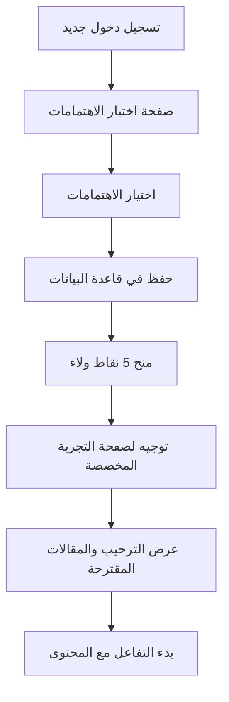
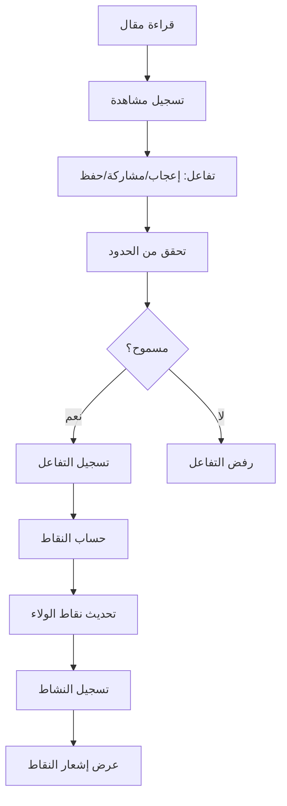
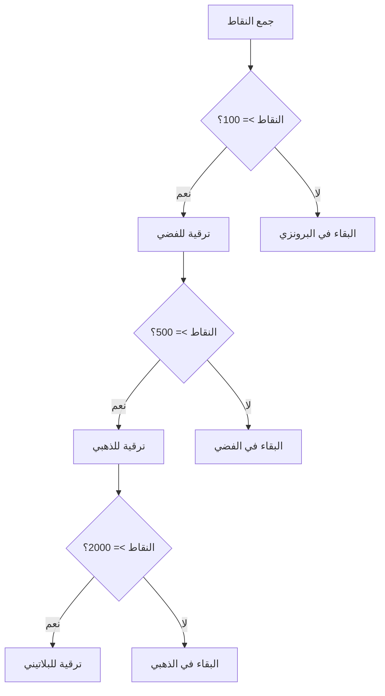

# دليل تدفق تجربة المستخدم ونظام الولاء - صحيفة سبق

## نظرة عامة

تم تطوير نظام شامل لتحسين تجربة المستخدم وتفعيل نظام الولاء في صحيفة سبق، يتضمن إصلاح مشاكل الاهتمامات وتفعيل تتبع التفاعلات ونقاط الولاء.

## 🎯 المشاكل المحلولة

### 1. مشكلة الاهتمامات في الملف الشخصي
- **المشكلة**: عدم حفظ الاهتمامات فعلياً في قاعدة البيانات
- **المشكلة**: توجيه المستخدم إلى صفحة 404 بعد اختيار الاهتمامات
- **الحل**: ربط الاهتمامات بملف المستخدم وتوجيهه لصفحة تجربة مخصصة

### 2. نظام الولاء والأنشطة غير مفعّل
- **المشكلة**: عرض نقاط الولاء بـ"صفر" دائماً
- **المشكلة**: عدم تسجيل التفاعلات والأنشطة
- **الحل**: نظام شامل لتتبع التفاعلات وحساب النقاط

### 3. عدم وجود تجربة مخصصة
- **المشكلة**: عدم وجود صفحة ترحيبية بعد الاهتمامات
- **الحل**: صفحة تجربة مخصصة مع مقالات مقترحة ونقاط الولاء

## 🛠️ المكونات المطورة

### 1. نظام الاهتمامات المحسن
**الملف**: `app/welcome/preferences/page.tsx`

**الميزات الجديدة**:
- حفظ الاهتمامات في localStorage و قاعدة البيانات
- منح 5 نقاط ولاء عند إتمام الاهتمامات
- توجيه تلقائي لصفحة التجربة المخصصة
- واجهة تفاعلية محسنة

**مثال الاستخدام**:
```typescript
const handleSave = async () => {
  try {
    // حفظ الاهتمامات
    const userData = { id: userId, name: userName, interests: selectedInterests };
    localStorage.setItem('user', JSON.stringify(userData));
    
    // منح نقاط الولاء
    await fetch('/api/loyalty', {
      method: 'POST',
      body: JSON.stringify({
        userId,
        action: 'complete_interests',
        points: 5,
        description: 'إتمام اختيار الاهتمامات'
      })
    });
    
    // التوجيه للصفحة المخصصة
    router.push('/welcome/feed');
  } catch (error) {
    console.error('خطأ في حفظ الاهتمامات:', error);
  }
};
```

### 2. صفحة التجربة المخصصة
**الملف**: `app/welcome/feed/page.tsx`

**الميزات**:
- ترحيب شخصي باسم المستخدم
- عرض الاهتمامات المختارة
- مقالات مقترحة بناءً على الاهتمامات
- عرض نقاط الولاء المكتسبة
- نصائح لتحقيق أقصى استفادة
- إحصائيات تحفيزية

**البيانات المعروضة**:
```typescript
interface UserData {
  id: string;
  name: string;
  interests: string[];
}

interface WelcomeFeedData {
  user: UserData;
  recommendedArticles: Article[];
  loyaltyPoints: number;
  tierInfo: TierInfo;
}
```

### 3. نظام تتبع التفاعلات الشامل
**الملف**: `app/api/interactions/track-activity/route.ts`

**أنواع التفاعلات المدعومة**:
- **قراءة مقال**: 1 نقطة (حد أقصى مرة واحدة لكل مقال)
- **إعجاب**: 1 نقطة (حد أقصى مرة واحدة لكل مقال)
- **مشاركة**: 3 نقاط (حد أقصى مرة واحدة لكل مقال)
- **حفظ مقال**: 1 نقطة (حد أقصى مرة واحدة لكل مقال)
- **تعليق**: 4 نقاط (حد أقصى مرة واحدة لكل مقال)

**مثال الاستخدام**:
```typescript
const trackInteraction = async (interactionType: string) => {
  const response = await fetch('/api/interactions/track-activity', {
    method: 'POST',
    headers: { 'Content-Type': 'application/json' },
    body: JSON.stringify({
      userId: user.id,
      articleId: article.id,
      interactionType,
      metadata: {
        source: 'article_page',
        timestamp: new Date().toISOString()
      }
    })
  });
  
  const result = await response.json();
  if (result.success && result.points_earned > 0) {
    showToast(`🎉 ${result.message}`);
  }
};
```

### 4. نظام إدارة نقاط الولاء
**الملف**: `app/api/loyalty/route.ts`

**المستويات**:
- **البرونزي**: 0-99 نقطة
- **الفضي**: 100-499 نقطة
- **الذهبي**: 500-1999 نقطة
- **البلاتيني**: 2000+ نقطة

**الميزات**:
- حساب تلقائي للمستوى
- تتبع التقدم للمستوى التالي
- تاريخ شامل للنقاط
- إحصائيات مفصلة

**مثال الاستخدام**:
```typescript
// جلب نقاط الولاء
const response = await fetch(`/api/loyalty?userId=${userId}&includeHistory=true&includeActivities=true`);
const data = await response.json();

if (data.success) {
  const { loyalty, activities } = data;
  console.log(`المستوى: ${loyalty.tier}`);
  console.log(`النقاط: ${loyalty.total_points}`);
  console.log(`التقدم: ${loyalty.tier_info.progressPercentage}%`);
}
```

### 5. تحسين مكونات التفاعل في المقالات
**الملف**: `app/article/[id]/page.tsx`

**التحسينات**:
- تتبع تلقائي للتفاعلات
- إشعارات فورية بالنقاط المكتسبة
- منع التفاعلات المكررة
- تحديث فوري للواجهة

**مثال التفاعل**:
```typescript
const handleLike = async () => {
  const newLiked = !interaction.liked;
  
  // تحديث الواجهة فوراً
  setInteraction(prev => ({ ...prev, liked: newLiked }));
  
  // تسجيل التفاعل
  const response = await fetch('/api/interactions/track-activity', {
    method: 'POST',
    body: JSON.stringify({
      userId,
      articleId: article.id,
      interactionType: newLiked ? 'like' : 'unlike'
    })
  });
  
  // عرض إشعار النقاط
  const result = await response.json();
  if (result.points_earned > 0) {
    showPointsToast(result.message);
  }
};
```

## 📊 ملفات البيانات

### 1. تفاعلات المستخدمين
**الملف**: `data/user_article_interactions.json`
```json
{
  "interactions": [
    {
      "id": "interaction-1234567890-abc123",
      "user_id": "user123",
      "article_id": "article456",
      "interaction_type": "like",
      "points_earned": 1,
      "metadata": {
        "source": "article_page",
        "timestamp": "2024-01-20T10:30:00.000Z"
      },
      "timestamp": "2024-01-20T10:30:00.000Z"
    }
  ]
}
```

### 2. نقاط الولاء
**الملف**: `data/user_loyalty_points.json`
```json
{
  "users": [
    {
      "user_id": "user123",
      "total_points": 25,
      "earned_points": 25,
      "redeemed_points": 0,
      "tier": "bronze",
      "history": [
        {
          "action": "complete_interests",
          "points": 5,
          "timestamp": "2024-01-20T10:00:00.000Z",
          "description": "إتمام اختيار الاهتمامات"
        }
      ],
      "created_at": "2024-01-20T10:00:00.000Z",
      "last_updated": "2024-01-20T10:30:00.000Z"
    }
  ]
}
```

### 3. أنشطة المستخدمين
**الملف**: `data/user_activities.json`
```json
{
  "activities": [
    {
      "id": "activity-1234567890-abc123",
      "user_id": "user123",
      "action": "like",
      "description": "إعجاب بمقال - article456",
      "points_earned": 1,
      "article_id": "article456",
      "metadata": {
        "source": "article_page"
      },
      "timestamp": "2024-01-20T10:30:00.000Z"
    }
  ]
}
```

## 🔄 تدفق التجربة الكامل

### 1. المستخدم الجديد


### 2. تفاعل مع المقال


### 3. تطور المستوى


## 🎨 واجهة المستخدم

### 1. إشعارات النقاط
```typescript
const showPointsToast = (message: string) => {
  const toast = document.createElement('div');
  toast.className = 'fixed top-4 right-4 bg-green-500 text-white px-4 py-2 rounded-lg shadow-lg z-50 animate-pulse';
  toast.textContent = `🎉 ${message}`;
  document.body.appendChild(toast);
  setTimeout(() => document.body.removeChild(toast), 3000);
};
```

### 2. مؤشر التقدم
```typescript
const ProgressBar = ({ currentPoints, nextTierPoints, percentage }) => (
  <div className="w-full bg-gray-200 rounded-full h-2">
    <div 
      className="bg-blue-600 h-2 rounded-full transition-all duration-500"
      style={{ width: `${percentage}%` }}
    />
    <p className="text-sm text-gray-600 mt-1">
      {nextTierPoints - currentPoints} نقطة للمستوى التالي
    </p>
  </div>
);
```

## 🔧 الاختبار والتحقق

### 1. اختبار تدفق الاهتمامات
```bash
# زيارة صفحة الاهتمامات
curl -X GET http://localhost:3000/welcome/preferences

# اختبار حفظ الاهتمامات
curl -X POST http://localhost:3000/api/loyalty \
  -H "Content-Type: application/json" \
  -d '{"userId":"test123","action":"complete_interests","points":5}'
```

### 2. اختبار تتبع التفاعلات
```bash
# تسجيل إعجاب
curl -X POST http://localhost:3000/api/interactions/track-activity \
  -H "Content-Type: application/json" \
  -d '{"userId":"test123","articleId":"article456","interactionType":"like"}'

# تسجيل مشاركة
curl -X POST http://localhost:3000/api/interactions/track-activity \
  -H "Content-Type: application/json" \
  -d '{"userId":"test123","articleId":"article456","interactionType":"share"}'
```

### 3. اختبار نقاط الولاء
```bash
# جلب نقاط الولاء
curl -X GET "http://localhost:3000/api/loyalty?userId=test123&includeHistory=true"

# إضافة نقاط يدوياً
curl -X POST http://localhost:3000/api/loyalty \
  -H "Content-Type: application/json" \
  -d '{"userId":"test123","action":"manual","points":10,"description":"نقاط إضافية"}'
```

## 📈 مؤشرات الأداء

### 1. معدلات التفاعل
- **معدل الإعجاب**: عدد الإعجابات / عدد المشاهدات
- **معدل المشاركة**: عدد المشاركات / عدد المشاهدات
- **معدل الحفظ**: عدد الحفظ / عدد المشاهدات

### 2. توزيع المستويات
- **البرونزي**: نسبة المستخدمين في المستوى البرونزي
- **الفضي**: نسبة المستخدمين في المستوى الفضي
- **الذهبي**: نسبة المستخدمين في المستوى الذهبي
- **البلاتيني**: نسبة المستخدمين في المستوى البلاتيني

### 3. متوسط النقاط
- **نقاط يومية**: متوسط النقاط المكتسبة يومياً
- **نقاط شهرية**: متوسط النقاط المكتسبة شهرياً
- **نقاط لكل تفاعل**: متوسط النقاط لكل نوع تفاعل

## 🚀 التطوير المستقبلي

### 1. ميزات مقترحة
- **مكافآت المستويات**: مكافآت خاصة لكل مستوى
- **تحديات يومية**: مهام يومية لكسب نقاط إضافية
- **نظام الإحالة**: نقاط لدعوة أصدقاء جدد
- **متجر النقاط**: استبدال النقاط بمكافآت

### 2. تحسينات تقنية
- **تحليلات متقدمة**: تقارير مفصلة عن سلوك المستخدمين
- **إشعارات فورية**: إشعارات في الوقت الفعلي
- **تخصيص أعمق**: خوارزميات أكثر ذكاءً للمحتوى المقترح
- **تكامل اجتماعي**: ربط مع شبكات التواصل الاجتماعي

## 🔐 الأمان والخصوصية

### 1. حماية البيانات
- تشفير البيانات الحساسة
- التحقق من صحة المدخلات
- منع الهجمات المتكررة
- حماية من التلاعب بالنقاط

### 2. الخصوصية
- شفافية في جمع البيانات
- إمكانية حذف البيانات
- التحكم في الخصوصية
- امتثال لقوانين الخصوصية

## 📝 الخلاصة

تم تطوير نظام شامل لتحسين تجربة المستخدم في صحيفة سبق يتضمن:

✅ **إصلاح مشكلة الاهتمامات** - حفظ فعلي وتوجيه صحيح
✅ **نظام ولاء متكامل** - تتبع التفاعلات وحساب النقاط
✅ **تجربة مخصصة** - صفحة ترحيبية ومحتوى مقترح
✅ **واجهة تفاعلية** - إشعارات فورية ومؤشرات تقدم
✅ **نظام مستويات** - تحفيز المستخدمين للتفاعل أكثر

النظام الآن جاهز للاستخدام ويوفر تجربة مستخدم محسنة وتفاعلية تشجع على المشاركة والولاء للمنصة. 