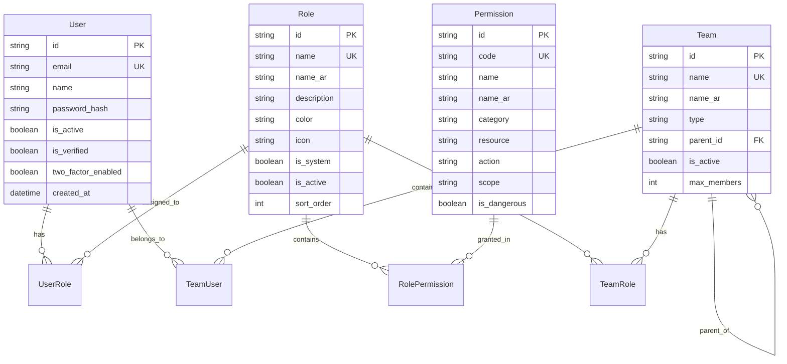

# نظام إدارة المستخدمين والصلاحيات RBAC - سبق الذكي

**تاريخ الإنشاء:** `${new Date().toISOString().split('T')[0]}`  
**المطور:** Ali Alhazmi  
**الإصدار:** v2.0.0  
**نوع النظام:** Role-Based Access Control (RBAC)  

---

## 📋 نظرة عامة

نظام إدارة المستخدمين والصلاحيات في منصة سبق الذكي هو نظام متطور يعتمد على مفهوم RBAC (Role-Based Access Control) مع دعم إدارة الفرق والمجموعات. يوفر النظام مرونة عالية في إدارة الصلاحيات والأدوار مع ضمان الأمان والتدقيق الشامل.

### ✨ الميزات الرئيسية

- **🔐 نظام RBAC متكامل** - إدارة الأدوار والصلاحيات بمرونة عالية
- **👥 إدارة الفرق والمجموعات** - تجميع المستخدمين في فرق عمل
- **🛡️ أمان متقدم** - تشفير، مصادقة ثنائية، جلسات آمنة
- **📊 تسجيل شامل للأنشطة** - تتبع كل العمليات والتغييرات
- **🎨 واجهة إدارية متطورة** - لوحة تحكم سهلة الاستخدام
- **⚡ أداء محسّن** - كاش الصلاحيات ومعالجة سريعة

---

## 🏗️ هيكل النظام

### قاعدة البيانات



### النماذج الأساسية

#### 1. المستخدم (User)
```typescript
interface User {
  id: string;
  email: string;
  name: string;
  password_hash: string;
  is_active: boolean;
  is_verified: boolean;
  two_factor_enabled: boolean;
  roles: UserRole[];
  teams: TeamUser[];
}
```

#### 2. الدور (Role)
```typescript
interface Role {
  id: string;
  name: string;
  name_ar: string;
  description?: string;
  color: string;
  icon: string;
  is_system: boolean;
  permissions: RolePermission[];
}
```

#### 3. الصلاحية (Permission)
```typescript
interface Permission {
  id: string;
  code: string;
  name: string;
  category: string;
  resource: string;
  action: string;
  scope: string;
  is_dangerous: boolean;
}
```

#### 4. الفريق (Team)
```typescript
interface Team {
  id: string;
  name: string;
  name_ar: string;
  type: string;
  parent_id?: string;
  roles: TeamRole[];
  users: TeamUser[];
}
```

---

## 🔑 إدارة الصلاحيات

### هيكل الصلاحيات

الصلاحيات في النظام تتبع نمط `resource:action` مع دعم المجالات (scopes):

```typescript
// أمثلة على الصلاحيات
const permissions = [
  'manage:users',      // إدارة كاملة للمستخدمين
  'create:articles',   // إنشاء مقالات
  'edit:own_articles', // تعديل المقالات الخاصة
  'moderate:comments', // إشراف التعليقات
  'view:analytics',    // عرض التحليلات
  'manage:*',          // إدارة كاملة (wildcard)
  '*'                  // صلاحيات كاملة
];
```

### فئات الصلاحيات

| الفئة | الوصف | أمثلة |
|------|--------|-------|
| `users` | إدارة المستخدمين | `manage:users`, `create:users` |
| `content` | إدارة المحتوى | `create:articles`, `publish:articles` |
| `moderation` | الإشراف والمراقبة | `moderate:comments`, `manage:reports` |
| `analytics` | التحليلات والتقارير | `view:analytics`, `export:analytics` |
| `system` | إدارة النظام | `manage:roles`, `view:audit_logs` |
| `teams` | إدارة الفرق | `manage:teams`, `join:teams` |
| `media` | إدارة الوسائط | `upload:media`, `manage:media` |

---

## 👥 إدارة الأدوار

### الأدوار الافتراضية

| الدور | الوصف | الصلاحيات |
|-------|--------|-----------|
| `super_admin` 👑 | المدير العام | جميع الصلاحيات |
| `admin` ⚙️ | المدير | معظم الصلاحيات عدا النظامية |
| `editor_chief` 📝 | رئيس التحرير | إدارة المحتوى والإشراف |
| `editor` ✏️ | المحرر | تحرير ونشر المقالات |
| `author` ✍️ | الكاتب | كتابة المقالات الخاصة |
| `moderator` 🛡️ | المراقب | إشراف التعليقات |
| `analyst` 📊 | المحلل | عرض وتحليل الإحصائيات |
| `reader` 👤 | القارئ | قراءة المحتوى فقط |

### إنشاء دور مخصص

```javascript
// إنشاء دور جديد
const roleData = {
  name: 'content_reviewer',
  name_ar: 'مراجع المحتوى',
  description: 'مراجعة وقبول المحتوى قبل النشر',
  color: '#8B5CF6',
  icon: '📋',
  permission_ids: [
    'view:articles',
    'edit:articles',
    'approve:articles'
  ]
};

fetch('/api/admin/roles', {
  method: 'POST',
  headers: { 'Content-Type': 'application/json' },
  body: JSON.stringify(roleData)
});
```

---

## 🏢 إدارة الفرق

### أنواع الفرق

- **تحريرية** (`editorial`) - فرق التحرير والكتابة
- **إشرافية** (`moderation`) - فرق الإشراف والمراقبة
- **تحليلية** (`analytics`) - فرق التحليل والإحصائيات
- **إدارية** (`administrative`) - فرق الإدارة
- **مشاريع** (`project`) - فرق مشاريع محددة

### إنشاء فريق جديد

```javascript
const teamData = {
  name: 'sports_editorial_team',
  name_ar: 'فريق تحرير الرياضة',
  description: 'فريق مختص بتحرير المحتوى الرياضي',
  type: 'editorial',
  color: '#10B981',
  icon: '⚽',
  role_ids: ['editor', 'author'] // الأدوار المرتبطة بالفريق
};
```

### هيكل هرمي للفرق

```javascript
// فريق رئيسي
const mainTeam = {
  name: 'content_department',
  name_ar: 'قسم المحتوى'
};

// فريق فرعي
const subTeam = {
  name: 'sports_content_team',
  name_ar: 'فريق المحتوى الرياضي',
  parent_id: mainTeam.id
};
```

---

## 🔒 ميزات الأمان

### 1. مصادقة متعددة العوامل (2FA)

```typescript
// تفعيل المصادقة الثنائية
const enable2FA = async (userId: string) => {
  const secret = generateTOTPSecret();
  const qrCode = generateQRCode(secret, userEmail);
  
  await updateUser(userId, {
    two_factor_enabled: true,
    two_factor_secret: encrypt(secret)
  });
  
  return { secret, qrCode };
};
```

### 2. إدارة الجلسات المتقدمة

```typescript
interface UserSession {
  id: string;
  user_id: string;
  device_id: string;
  device_name: string;
  device_type: 'mobile' | 'desktop' | 'tablet';
  ip_address: string;
  location: object;
  is_trusted: boolean;
  last_activity: Date;
  expires_at: Date;
}
```

### 3. تشفير البيانات الحساسة

- **كلمات المرور**: Argon2 مع salt عشوائي
- **البيانات الشخصية**: AES-256-GCM
- **رموز الجلسات**: JWT مع توقيع رقمي
- **بيانات المصادقة الثنائية**: تشفير متقدم

---

## 📊 تسجيل الأنشطة (Audit Logging)

### أنواع الأحداث المسجلة

```typescript
interface AuditLog {
  id: string;
  user_id: string;
  action: string;
  resource: string;
  resource_id: string;
  old_values?: object;
  new_values?: object;
  ip_address: string;
  user_agent: string;
  timestamp: Date;
  success: boolean;
}

// أمثلة على الأحداث
const auditEvents = [
  'USER_CREATED',
  'USER_UPDATED', 
  'USER_DELETED',
  'ROLE_ASSIGNED',
  'ROLE_REVOKED',
  'PERMISSION_GRANTED',
  'PERMISSION_REVOKED',
  'TEAM_CREATED',
  'TEAM_MEMBER_ADDED',
  'LOGIN_SUCCESS',
  'LOGIN_FAILED',
  'PASSWORD_CHANGED',
  'TWO_FACTOR_ENABLED'
];
```

### تتبع التغييرات

```typescript
// تسجيل تغيير الصلاحيات
const logPermissionChange = async (change: {
  userId: string;
  action: 'grant' | 'revoke';
  permission: string;
  grantor: string;
}) => {
  await createAuditLog({
    user_id: change.grantor,
    action: `PERMISSION_${change.action.toUpperCase()}`,
    resource: 'permission',
    resource_id: change.permission,
    details: {
      target_user: change.userId,
      permission: change.permission
    }
  });
};
```

---

## 🔧 APIs الرئيسية

### إدارة الأدوار

```typescript
// جلب جميع الأدوار
GET /api/admin/roles?include_permissions=true

// إنشاء دور جديد
POST /api/admin/roles
{
  "name": "content_manager",
  "name_ar": "مدير المحتوى",
  "permission_ids": ["create:articles", "edit:articles"]
}

// تحديث دور
PUT /api/admin/roles/:id

// حذف أدوار متعددة
DELETE /api/admin/roles?ids=id1,id2,id3
```

### إدارة الصلاحيات

```typescript
// جلب جميع الصلاحيات
GET /api/admin/permissions?category=content

// الصلاحيات مجمعة حسب الفئة
GET /api/admin/permissions
{
  "success": true,
  "data": {
    "grouped": {
      "users": [...],
      "content": [...],
      "moderation": [...]
    }
  }
}
```

### إدارة الفرق

```typescript
// جلب جميع الفرق
GET /api/admin/teams

// إنشاء فريق جديد
POST /api/admin/teams
{
  "name": "editorial_team",
  "name_ar": "فريق التحرير",
  "role_ids": ["editor", "author"]
}

// تحديث أدوار الفريق
PUT /api/admin/teams/:id/roles
{
  "role_ids": ["editor", "moderator"]
}
```

### التحقق من الصلاحيات

```typescript
// Middleware للتحقق من صلاحية
import { requirePermission } from '@/lib/rbac-middleware';

export async function POST(request: NextRequest) {
  const authResult = await requirePermission('manage:users')(request);
  
  if (!authResult.success) {
    return NextResponse.json({ error: authResult.error }, { status: 403 });
  }
  
  // المتابعة مع العملية...
}

// التحقق من عدة شروط
import { requireAccess } from '@/lib/rbac-middleware';

const authResult = await requireAccess({
  permissions: ['edit:articles'],
  teams: ['editorial_team'],
  requireAll: false // واحد على الأقل
})(request);
```

---

## 🎨 الواجهات الإدارية

### مكونات React المتاحة

#### 1. قائمة الأدوار
```jsx
import RoleList from '@/components/admin/roles/RoleList';

<RoleList 
  onEditRole={handleEditRole}
  onDeleteRole={handleDeleteRole}
  refreshTrigger={refreshCounter}
/>
```

#### 2. نموذج إنشاء/تعديل الأدوار
```jsx
import RoleForm from '@/components/admin/roles/RoleForm';

<RoleForm
  role={selectedRole}
  isOpen={isFormOpen}
  onSave={handleSaveRole}
  onCancel={handleCancel}
/>
```

#### 3. إدارة الفرق
```jsx
import TeamList from '@/components/admin/teams/TeamList';
import CreateTeam from '@/components/admin/teams/CreateTeam';
import EditTeamRoles from '@/components/admin/teams/EditTeamRoles';

// عرض الفرق
<TeamList onEditTeam={handleEditTeam} />

// إنشاء فريق جديد
<CreateTeam onCreated={handleTeamCreated} />

// تعديل أدوار الفريق
<EditTeamRoles 
  teamId={teamId}
  initialRoles={teamRoles}
  onSaved={handleRolesSaved}
/>
```

### التحقق من الصلاحيات في الواجهة

```jsx
import { RBACHelpers } from '@/lib/rbac-middleware';

function AdminPanel({ authContext }) {
  const canManageUsers = RBACHelpers.can(authContext, 'manage:users');
  const isAdmin = RBACHelpers.is(authContext, 'admin');
  const inEditorialTeam = RBACHelpers.inTeam(authContext, 'editorial_team');
  
  return (
    <div>
      {canManageUsers && (
        <button>إدارة المستخدمين</button>
      )}
      
      {isAdmin && (
        <AdminSettings />
      )}
      
      {inEditorialTeam && (
        <EditorialTools />
      )}
    </div>
  );
}
```

---

## 🚀 الاستخدام العملي

### سيناريو 1: إنشاء فريق تحرير رياضي

```javascript
// 1. إنشاء الفريق
const team = await createTeam({
  name: 'sports_editorial',
  name_ar: 'فريق تحرير الرياضة',
  type: 'editorial',
  role_ids: ['editor', 'author']
});

// 2. إضافة أعضاء للفريق
await addTeamMembers(team.id, [
  { user_id: 'user1', role_in_team: 'team_lead' },
  { user_id: 'user2', role_in_team: 'member' },
  { user_id: 'user3', role_in_team: 'member' }
]);

// 3. المستخدمون يحصلون تلقائياً على صلاحيات الأدوار المرتبطة بالفريق
```

### سيناريو 2: منح صلاحيات مؤقتة

```javascript
// منح دور مؤقت لمستخدم
await assignUserRole({
  user_id: 'user123',
  role_id: 'moderator',
  expires_at: new Date(Date.now() + 7 * 24 * 60 * 60 * 1000), // أسبوع
  granted_by: 'admin_user_id'
});

// النظام سيلغي الدور تلقائياً بعد انتهاء المدة
```

### سيناريو 3: صلاحيات مخصصة لمستخدم

```javascript
// منح صلاحية خاصة لمستخدم محدد
await grantUserPermission({
  user_id: 'special_user',
  permission_id: 'access:vip_content',
  granted_by: 'admin',
  reason: 'VIP member access'
});
```

---

## ⚡ تحسين الأداء

### 1. كاش الصلاحيات

```typescript
// كاش صلاحيات المستخدم في الجلسة
interface UserSession {
  permissions_cache: string[];
  roles_cache: string[];
  teams_cache: string[];
  cache_expires_at: Date;
}

// تحديث الكاش عند تغيير الصلاحيات
const updatePermissionsCache = async (userId: string) => {
  const permissions = await getUserPermissions(userId);
  await updateSessionCache(userId, { permissions_cache: permissions });
};
```

### 2. فهرسة قاعدة البيانات

```sql
-- فهارس لتحسين الاستعلامات
CREATE INDEX idx_user_roles_user_id ON user_roles(user_id);
CREATE INDEX idx_user_roles_active ON user_roles(user_id, is_active);
CREATE INDEX idx_role_permissions_role_id ON role_permissions(role_id);
CREATE INDEX idx_team_users_user_team ON team_users(user_id, team_id);
CREATE INDEX idx_permissions_category ON permissions(category);
```

### 3. معالجة متوازية

```typescript
// جلب صلاحيات المستخدم بالتوازي
const getUserAllPermissions = async (userId: string) => {
  const [userRoles, userTeams, directPermissions] = await Promise.all([
    getUserRoles(userId),
    getUserTeams(userId),
    getDirectUserPermissions(userId)
  ]);
  
  return mergePermissions(userRoles, userTeams, directPermissions);
};
```

---

## 🔍 استكشاف الأخطاء

### مشاكل شائعة وحلولها

#### 1. المستخدم لا يملك الصلاحيات المتوقعة

```bash
# فحص صلاحيات المستخدم
curl -X GET "/api/debug/user/:userId/permissions" \
  -H "Authorization: Bearer $TOKEN"

# النتيجة المتوقعة
{
  "user_permissions": ["create:articles", "edit:own_articles"],
  "role_permissions": {
    "author": ["create:articles", "edit:own_articles"]
  },
  "team_permissions": {
    "editorial_team": ["moderate:comments"]
  }
}
```

#### 2. الأدوار لا تظهر في الواجهة

```javascript
// تحقق من API الأدوار
const checkRolesAPI = async () => {
  try {
    const response = await fetch('/api/admin/roles');
    const data = await response.json();
    console.log('Roles data:', data);
  } catch (error) {
    console.error('Roles API error:', error);
  }
};
```

#### 3. مشاكل في الجلسات

```javascript
// تحقق من الجلسة النشطة
const checkSession = async () => {
  const session = await getCurrentSession();
  console.log('Session info:', {
    userId: session.user_id,
    expiresAt: session.expires_at,
    isActive: session.is_active,
    permissionsCache: session.permissions_cache
  });
};
```

---

## 📈 مراقبة النظام

### مؤشرات الأداء الرئيسية

- **زمن التحقق من الصلاحيات** < 50ms
- **معدل نجاح المصادقة** > 99%
- **زمن تحميل الأدوار** < 100ms
- **حجم كاش الصلاحيات** متوسط 2KB لكل مستخدم

### تنبيهات الأمان

```typescript
// مراقبة محاولات الدخول المشبوهة
const securityAlerts = [
  'عدة محاولات دخول فاشلة من IP واحد',
  'محاولة الوصول لصلاحيات غير مخولة',
  'تغيير مشبوه في الأدوار',
  'دخول من موقع جغرافي غير عادي'
];

// إرسال تنبيه أمني
const sendSecurityAlert = async (alert: {
  type: string;
  userId: string;
  details: object;
}) => {
  await notifySecurityTeam(alert);
  await logSecurityEvent(alert);
};
```

---

## 🔄 التحديثات والصيانة

### ترقية النظام

```bash
# 1. النسخ الاحتياطي
npm run backup:database

# 2. ترقية المخطط
npx prisma migrate deploy

# 3. تحديث البيانات الافتراضية
npm run seed:permissions

# 4. إعادة بناء الكاش
npm run rebuild:cache
```

### مهام الصيانة الدورية

```javascript
// تنظيف الجلسات المنتهية الصلاحية
const cleanupExpiredSessions = async () => {
  await prisma.userSession.deleteMany({
    where: { expires_at: { lt: new Date() } }
  });
};

// تنظيف سجلات التدقيق القديمة (أكثر من سنة)
const cleanupOldAuditLogs = async () => {
  const oneYearAgo = new Date();
  oneYearAgo.setFullYear(oneYearAgo.getFullYear() - 1);
  
  await prisma.auditLog.deleteMany({
    where: { created_at: { lt: oneYearAgo } }
  });
};

// مهمة دورية يومية
setInterval(async () => {
  await cleanupExpiredSessions();
  await updatePermissionsCache();
}, 24 * 60 * 60 * 1000); // كل 24 ساعة
```

---

## 📞 الدعم والتطوير المستقبلي

### الميزات المخططة

- **🔍 محرك بحث متقدم** للأدوار والصلاحيات
- **📱 تطبيق موبايل** لإدارة الصلاحيات
- **🤖 AI للكشف عن الأنماط المشبوهة**
- **🌐 دعم SSO مع خدمات خارجية**
- **📊 لوحة تحليلات متقدمة** لاستخدام الصلاحيات

### للمطورين

```javascript
// إضافة صلاحية جديدة
const addNewPermission = async () => {
  await prisma.permission.create({
    data: {
      code: 'manage:advanced_analytics',
      name: 'Manage Advanced Analytics',
      name_ar: 'إدارة التحليلات المتقدمة',
      category: 'analytics',
      resource: 'analytics',
      action: 'manage',
      is_dangerous: false
    }
  });
};

// إضافة middleware جديد
export const requireAdvancedAnalytics = requirePermission('manage:advanced_analytics');
```

---

## 📝 خلاصة

نظام إدارة المستخدمين والصلاحيات في سبق الذكي يوفر:

✅ **مرونة عالية** في إدارة الأدوار والصلاحيات  
✅ **أمان متقدم** مع تشفير وتسجيل شامل  
✅ **واجهة سهلة الاستخدام** للإدارة والتحكم  
✅ **أداء محسّن** مع كاش ذكي  
✅ **قابلية التوسع** للمتطلبات المستقبلية  

النظام جاهز للاستخدام في البيئة الإنتاجية ويدعم جميع المتطلبات الحديثة لإدارة المستخدمين في المنصات الرقمية الكبيرة.

---

**© 2024 Sabq AI - جميع الحقوق محفوظة** 