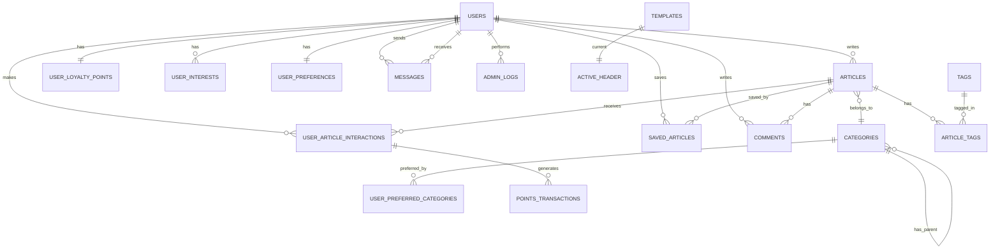

# 🗺️ خريطة العلاقات بين الكيانات

## 📅 آخر تحديث: 19 يونيو 2025

---

## 📊 مخطط العلاقات الرئيسي



---

## 🔗 تفاصيل العلاقات

### 1. المستخدمون (USERS)

#### العلاقات الصادرة:
- **يكتب** → مقالات (1:N)
- **يتفاعل مع** → مقالات (M:N عبر USER_ARTICLE_INTERACTIONS)
- **يملك** → نقاط ولاء (1:1)
- **له** → اهتمامات (1:N)
- **له** → تفضيلات (1:1)
- **يرسل** → رسائل (1:N)
- **يستقبل** → رسائل (1:N)
- **يحفظ** → مقالات (M:N عبر SAVED_ARTICLES)
- **يعلق على** → مقالات (1:N عبر COMMENTS)

#### الحقول الرئيسية:
```json
{
  "id": "المعرف الفريد",
  "email": "البريد الإلكتروني (فريد)",
  "role": "الدور في النظام",
  "status": "حالة الحساب",
  "loyaltyPoints": "نقاط الولاء المحسوبة"
}
```

### 2. المقالات (ARTICLES)

#### العلاقات الصادرة:
- **ينتمي إلى** → تصنيف (N:1)
- **كتبه** → مستخدم (N:1)
- **له** → وسوم (M:N عبر ARTICLE_TAGS)
- **يتلقى** → تفاعلات (1:N)
- **محفوظ من** → مستخدمين (M:N)
- **له** → تعليقات (1:N)

#### الحقول الرئيسية:
```json
{
  "id": "المعرف الفريد",
  "slug": "الرابط الثابت (فريد)",
  "category_id": "معرف التصنيف",
  "author_id": "معرف الكاتب",
  "status": "حالة النشر"
}
```

### 3. التصنيفات (CATEGORIES)

#### العلاقات:
- **يحتوي** → مقالات (1:N)
- **له أب** → تصنيف آخر (N:1 ذاتي)
- **مفضل من** → مستخدمين (M:N)

#### الهيكل الهرمي:
```
تصنيف رئيسي
├── تصنيف فرعي 1
│   ├── تصنيف فرعي 1.1
│   └── تصنيف فرعي 1.2
└── تصنيف فرعي 2
```

### 4. نظام الولاء

#### العلاقات:
```
USER → USER_LOYALTY_POINTS (1:1)
     → USER_ARTICLE_INTERACTIONS → POINTS_TRANSACTIONS
```

#### تدفق النقاط:
1. المستخدم يتفاعل مع مقال
2. يُسجل التفاعل في USER_ARTICLE_INTERACTIONS
3. تُحسب النقاط وتُضاف إلى USER_LOYALTY_POINTS
4. يُسجل التحديث في POINTS_TRANSACTIONS

### 5. التفاعلات (INTERACTIONS)

#### أنواع التفاعلات ونقاطها:
| النوع | النقاط | الوصف |
|-------|--------|-------|
| view | 1 | مشاهدة المقال |
| read | 10 | قراءة 80% من المقال |
| like | 5 | الإعجاب بالمقال |
| share | 15 | مشاركة المقال |
| save | 5 | حفظ المقال |

---

## 🔄 سيناريوهات الاستخدام

### سيناريو 1: قراءة مقال
```
1. USER → views → ARTICLE
2. System → creates → USER_ARTICLE_INTERACTION (type: view)
3. System → awards → 1 point
4. System → updates → USER_LOYALTY_POINTS
5. System → logs → POINTS_TRANSACTION
```

### سيناريو 2: نشر مقال جديد
```
1. EDITOR → creates → ARTICLE (status: draft)
2. EDITOR → assigns → CATEGORY
3. EDITOR → adds → TAGS
4. ADMIN → reviews → ARTICLE
5. ADMIN → publishes → ARTICLE
6. System → logs → ADMIN_LOG
7. System → updates → CATEGORY.article_count
```

### سيناريو 3: تخصيص المحتوى
```
1. System → analyzes → USER_ARTICLE_INTERACTIONS
2. System → identifies → preferred CATEGORIES
3. System → updates → USER_PREFERRED_CATEGORIES
4. System → calculates → recommendation scores
5. Frontend → displays → personalized content
```

---

## 📈 إحصائيات العلاقات

### كثافة البيانات المتوقعة:
- **مستخدم واحد**: ~100 تفاعل/شهر
- **مقال واحد**: ~1000 مشاهدة/يوم
- **تصنيف واحد**: ~50 مقال/شهر

### نسب العلاقات:
- **مستخدمون:مقالات** = 1000:1 (لكل 1000 مستخدم، كاتب واحد)
- **مقالات:تفاعلات** = 1:500 (كل مقال يحصل على 500 تفاعل)
- **مستخدمون:نقاط** = 1:1 (كل مستخدم له سجل نقاط واحد)

---

## 🔐 قواعد التكامل

### 1. تكامل البيانات (Data Integrity)
- لا يمكن حذف مستخدم له مقالات منشورة
- لا يمكن حذف تصنيف يحتوي على مقالات
- النقاط لا يمكن أن تكون سالبة

### 2. قواعد الأعمال (Business Rules)
- المستخدم لا يمكنه التفاعل مع نفس المقال بنفس الطريقة مرتين
- النقاط تُحسب مرة واحدة فقط لكل تفاعل
- المقالات المجدولة تُنشر تلقائياً في وقتها

### 3. الأمان (Security)
- كلمات المرور مشفرة دائماً
- البيانات الحساسة لا تُرجع في APIs
- السجلات تحفظ جميع العمليات الحرجة

---

## 🛠️ أدوات مفيدة

### استعلامات شائعة:

#### 1. جلب مقالات مستخدم مع التفاعلات:
```sql
SELECT a.*, 
       COUNT(DISTINCT uai.id) as interaction_count,
       SUM(uai.points_earned) as total_points
FROM articles a
LEFT JOIN user_article_interactions uai ON a.id = uai.article_id
WHERE a.author_id = ?
GROUP BY a.id;
```

#### 2. حساب مستوى العضوية:
```javascript
function getMembershipLevel(points) {
  if (points >= 2001) return 'سفير';
  if (points >= 501) return 'ذهبي';
  if (points >= 101) return 'فضي';
  return 'برونزي';
}
```

#### 3. جلب المحتوى المخصص:
```sql
SELECT a.* 
FROM articles a
JOIN user_preferred_categories upc ON a.category_id = upc.category_id
WHERE upc.user_id = ?
  AND a.status = 'published'
ORDER BY upc.score DESC, a.published_at DESC
LIMIT 10;
```

---

## 📝 ملاحظات التطوير

### 1. التحسينات المستقبلية:
- إضافة نظام توصيات بالذكاء الاصطناعي
- تطبيق GraphQL للاستعلامات المعقدة
- نظام cache متقدم مع Redis

### 2. الأداء:
- فهرسة جميع foreign keys
- استخدام eager loading للعلاقات
- تطبيق pagination على جميع القوائم

### 3. القابلية للتوسع:
- تصميم يدعم sharding
- APIs stateless
- معرفات UUID للتوزيع

---

هذا المستند يُحدث بشكل دوري مع تطور النظام. 