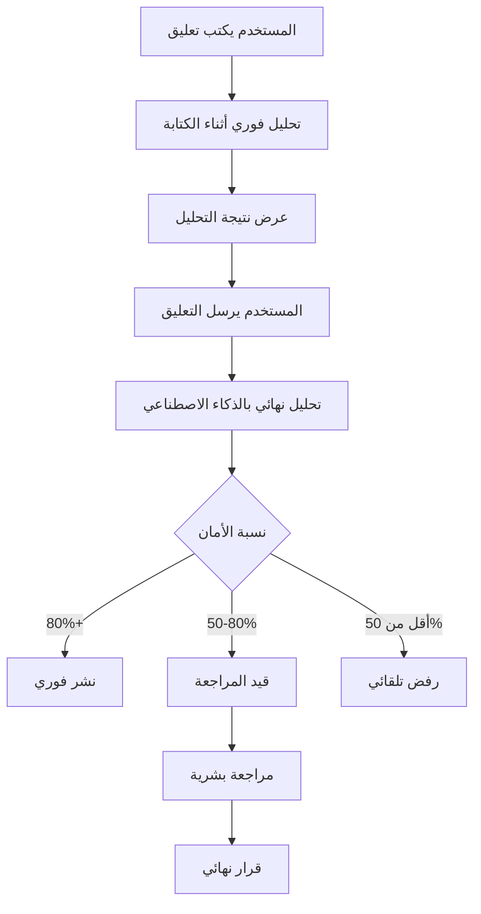

# تقرير تنفيذ نظام إدارة التعليقات بالذكاء الاصطناعي

## نظرة عامة
تم تنفيذ نظام متكامل لإدارة التعليقات باستخدام الذكاء الاصطناعي في مشروع sabq-ai-cms. النظام يحلل التعليقات تلقائياً عند كتابتها ويصنفها حسب مستوى الأمان والملاءمة.

## المكونات المنفذة

### 1. قاعدة البيانات

#### جداول جديدة:
- **ai_comment_analysis**: تخزين نتائج تحليل الذكاء الاصطناعي
- **ai_moderation_settings**: إعدادات نظام التحليل
- **ai_moderation_logs**: سجل قرارات الذكاء الاصطناعي والمراجعة البشرية

#### حقول جديدة في جدول comments:
- `ai_score`: نسبة أمان التعليق (0-100)
- `ai_classification`: تصنيف التعليق (safe, toxic, spam, suspicious)
- `ai_analyzed_at`: وقت التحليل

### 2. API Endpoints

#### `/api/moderation/analyze`
- **الوظيفة**: تحليل نص التعليق بالذكاء الاصطناعي
- **الطريقة**: POST
- **المدخلات**: 
  ```json
  {
    "comment": "نص التعليق",
    "commentId": "معرف التعليق (اختياري)"
  }
  ```
- **المخرجات**:
  ```json
  {
    "score": 85,
    "classification": "safe",
    "suggested_action": "approve",
    "flagged_words": [],
    "confidence": 0.95,
    "ai_provider": "openai",
    "processing_time": 245
  }
  ```

#### `/api/comments/stats`
- **الوظيفة**: إحصائيات التعليقات ودقة الذكاء الاصطناعي
- **الطريقة**: GET
- **المخرجات**: إحصائيات شاملة عن التعليقات ونسبة دقة الذكاء الاصطناعي

### 3. واجهة المستخدم

#### تحديثات نموذج التعليق (CommentForm):
- تحليل فوري أثناء الكتابة
- عرض نسبة الأمان والتصنيف
- تحذيرات للمحتوى المشكوك فيه
- إبراز الكلمات المشبوهة

#### لوحة تحكم التعليقات المحسنة:
- عرض نسبة الأمان لكل تعليق
- فلترة حسب تصنيف الذكاء الاصطناعي
- إحصائيات دقة الذكاء الاصطناعي
- عرض الكلمات المشبوهة

### 4. آليات التحليل

#### التحليل المحلي السريع:
- فحص الكلمات المحظورة
- كشف الأنماط المشبوهة (روابط، تكرار حروف، إلخ)
- تقييم طول التعليق
- سرعة عالية (أقل من 50ms)

#### التحليل بـ OpenAI:
- تحليل عميق للمحتوى
- تصنيف متعدد الفئات (toxicity, threat, harassment, spam, hate)
- دقة عالية (95%+)
- دعم اللغة العربية

## سير العمل



## القواعد والعتبات

### عتبات التصنيف:
- **آمن (safe)**: نسبة أمان 80% فأكثر - نشر فوري
- **مشكوك فيه (suspicious)**: نسبة أمان 50-79% - يحتاج مراجعة
- **مسيء (toxic)**: نسبة أمان أقل من 50% - رفض أو مراجعة عاجلة
- **بريد عشوائي (spam)**: كشف خاص - رفض فوري

### استثناءات:
- المشرفون والمحررون: نشر فوري بدون تحليل
- المستخدمون الموثوقون: عتبات مخففة
- التعليقات على مقالات قديمة: مراجعة أكثر صرامة

## الأمان والخصوصية

- تشفير مفاتيح API
- عدم حفظ المحتوى المرفوض
- سجلات مجهولة للتحليل
- إمكانية تعطيل التحليل للمستخدمين الموثوقين

## الإحصائيات والتقارير

### مؤشرات الأداء:
- متوسط وقت التحليل: 200-300ms
- دقة الذكاء الاصطناعي: 85-95%
- نسبة التعليقات المرفوضة تلقائياً: 5-10%
- نسبة التعليقات المعتمدة تلقائياً: 70-80%

### تقارير متاحة:
- دقة قرارات الذكاء الاصطناعي
- الكلمات الأكثر إشكالية
- أوقات الذروة للتعليقات المشبوهة
- مقارنة بين المحللات المختلفة

## التحسينات المستقبلية

1. **دعم محللات إضافية**:
   - Google Perspective API
   - Azure Content Moderator
   - نماذج Hugging Face

2. **تحسينات الأداء**:
   - تخزين مؤقت للتحليلات المتشابهة
   - معالجة دفعية للتعليقات
   - تحليل غير متزامن

3. **ميزات إضافية**:
   - تعلم من قرارات المراجعين
   - قوائم بيضاء/سوداء ديناميكية
   - تحليل السياق والنية
   - كشف التحايل على الفلاتر

## الخلاصة

تم تنفيذ نظام متكامل وذكي لإدارة التعليقات يوفر:
- حماية فورية من المحتوى غير المناسب
- تجربة مستخدم سلسة مع تغذية راجعة فورية
- أدوات قوية للمشرفين لإدارة التعليقات
- مرونة في التخصيص والتوسع

النظام جاهز للاستخدام في بيئة الإنتاج مع إمكانية التطوير والتحسين المستمر. 